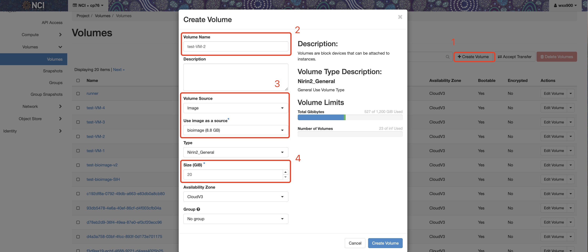
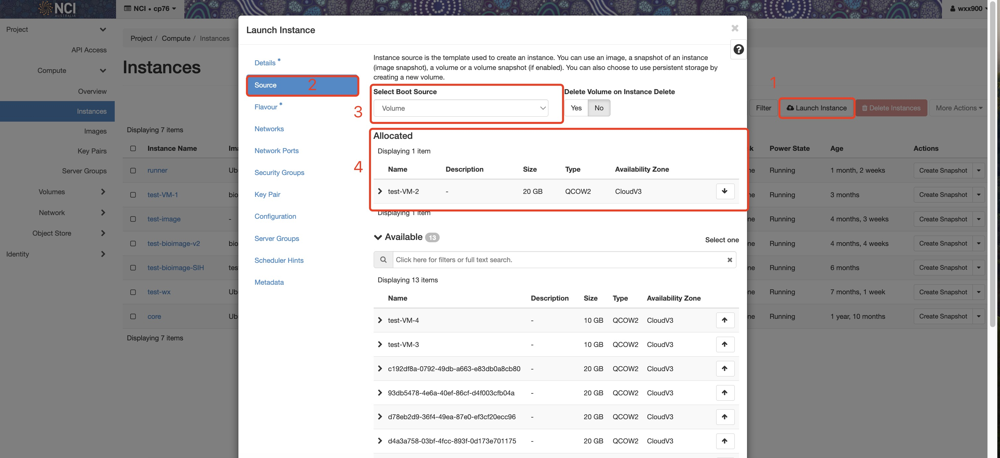

# BioImage
This repository is designed to build a custom Ubuntu-based bioimage and manage instances on NCI Nirin (OpenStack) platform (https://cloud.nci.org.au/).

----------------------------
## Table of Contents
----------------------------
* [Installation](#installation)
* [Environment](#environment)
    * [Setup](#setup)
    * [Activation](#activation)
* [Build Image](#build-image)
* [Instance Management](#instance-management)
    * [Create Instances and Boot Image](#create-instances-and-boot-image)
    * [Shut Down and Restart Instances](#shut-down-and-restart-instances)
* [User Access](#user-access)
    * [Single User per Instance](#single-user-per-instance)
    * [Multiple Users per Instance](#multiple-users-per-instance)
    * [Install New Tools](#install-new-tools)
    * [Set Up Home Directory](#set-up-home-directory)

## Installation

Launch an Ubuntu control host from Nirin Cloud access and clone this repository:
```
git clone https://github.com/eileen-xue/bioimage.git
cd bioimage
```

## Environment

### Setup
Install required tools: Packer, Ansible, OpenStack CLI. Download your OpenStack RC file `[project_id]-openrc.sh` from  NCI Cloud Dashboard and run:

Run the setup script to install dependencies and configure the environment:
```
./setup.sh
```

### Activation
Activate the environment before proceeding with image builds or instance management:
```
source openstack_cli/bin/activate
source [project_id]-openrc.sh
```

## Build Image

### Step 1: Initialize Packer
Navigate to the `build` directory and initialize the Packer plugins:
```
cd bioimage/build
packer init .
```

### Step 2: Build the BioImage
Run the following command to build the bioimage:
```
packer build openstack-bioimage.pkr.hcl
```
> **Note**: The default base is `Ubuntu Jammy Minimal 2024-07-01`. For broader system tool access, consider changing the `source_image` to a full Ubuntu image.

### Step 3: Verify Image
After the build process is complete, verify the newly created image by running:
```
openstack image list | grep bioimage
```
The image should include the following applications:
- Singularity
- SHPC
- Spack
- Ansible
- Jupyter Notebook
- RStudio
- Nextflow
- Snakemake
- CernVM-FS client

Check available modules with:
```
module avail
```

To use an application, load it with:
```
module load <app>
```

Access CVMFS repositories:
```
ls /cvmfs/data.biocommons.aarnet.edu.au
ls /cvmfs/data.galaxyproject.org
ls /cvmfs/singularity.galaxyproject.org

```

## Instance Management

### Create Instances and Boot Image
You may follow the [Nirin Quick Start Guide](https://opus.nci.org.au/spaces/Help/pages/152207474/Nirin+-+Quick+Start+Guide) , or use the script to create instances
```
cd bioimage/manage
./openstack/create-instances-with-image.sh
```

If instance creation fails using an image, create  **bootable volumes** instead:  

1. In the dashboard, create a volume with "Image" as the source.
    

    Once the volumes are created, you can launch instances from them.Use the NCI Cloud Dashboard to create volumes and assign them a consistent prefix (e.g., `training-VM-1`, `training-VM-2`, etc.).

2. Launch instances using existing volumes.
    To launch instances via dashboard, fill out the required sections: `Details`, `Source`, `Falvour`, and `Key pair`. In the **Source** section, select the option to boot from an existing volume.
    

For bulk operations:
```
cd bioimage/manage
./openstack/create-bootable-volumes.sh
./openstack/create-instances-with-volume.sh <key-pair> <VM-prefix>
```

### Shut Down and Restart Instances
Stop instances when they are not in use and restart them as needed.
```
./openstack/instances-start.sh <VM-prefix>
./openstack/instances-stop.sh <VM-prefix>
```

## User Access 

### Single User per Instance

#### Step 1: Generate passwords and Update IP Information
Generate passwords for each user and update the inventory file with the password and instance IPs.
```
cd bioimage/manage
python3 python/update-IP.py <VM-prefix> <project-id>
python3 python/update-keys.py <VM-prefix>
```

#### Step 2: Create Users and Enable Password Access
Add the `training` user with the generated passwords and enable password access.
```
ansible-playbook ./ansible/users-create-1-1.yml
ansible-playbook ./ansible/ssh-password-enable.yml
```

#### Step 3: Associate Floating IPs and Save VM Information
Create and associate floating IPs with the instances for public access. Save the username, password and public IP information in the `VMs` folder.
```
./openstack/floating-IP-create.sh <VM-prefix>
python3 python/list-VM-info.py <VM-prefix>  # Save each VM details to a txt file
python3 python/save-VM-info-csv.py <VM-prefix> # Or, save all VMs details to a csv file
```

#### Step 4: Delete Users, Disable Password and Public IP Access
After the training session, delete the `training` user accounts, disable password access and disacciate public IP.
```
ansible-playbook ./ansible/users-delete.yml
ansible-playbook ./ansible/ssh-password-disable.yml
./openstack/floating-IP-delete.sh <VM-prefix>
```

#### Step 5: Optional – Shut Down the Instances
Shut down the instances when they are not in use. 
```
./openstack/instances-stop.sh <VM-prefix>
```

### Multiple Users per Instance
When multiple users need to share the same instance, follow these steps:

#### Step 1: Step 1: Generate passwords and Update IP Information
Manually specify the number of users and generate their passwords.

1. Generate password keys:
```
cd bioimage/manage
python3 python/generate-keys.py
```

Update the file `host_vars/[VM-name].yml` with the generated passwords. Sample files are provided.

2. Rename the inventory file and update IPs:
Rename the `inventory.n` file to `invenroty` and run the command:
```
python3 python/update-IP.py <VM-prefix> <project-id>
```

#### Step 2: Create Users and Enable Password Access
Create all the users and enable password access for them:
```
ansible-playbook ./ansible/users-create-n-1.yml
ansible-playbook ./ansible/ssh-passwords-enable.yml
```

#### Step 3: Associate Floating IPs and Save VM Information
Create and associate floating IPs with the instances for public access. 
```
./openstack/floating-IP-create.sh <VM-prefix>
```

#### Step 4: Delete Users and Disable Password and Public IP Access
After the training session, remove user accounts, disable password access.
```
ansible-playbook ./ansible/users-delete-all.yml
ansible-playbook ./ansible/ssh-password-disable.yml
```

#### Step 5: Optional – Shut Down the Instances
Shut down the instances when they are not in use. 
```
./openstack/instances-stop.sh <VM-prefix>
```

### Install New Tools
`ansible/install-tools.yml` is an example script to install `tree`. Modify it to install more tools for all the VMs.
```
ansible-playbook ./ansible/install-tools.yml
```

### Set Up Home Directory
Use `ansible/set-home-dir.yml` as an example to set up a custom Home directory for training users. Modify it as needed.
```
ansible-playbook ./ansible/set-home-dir.yml
```